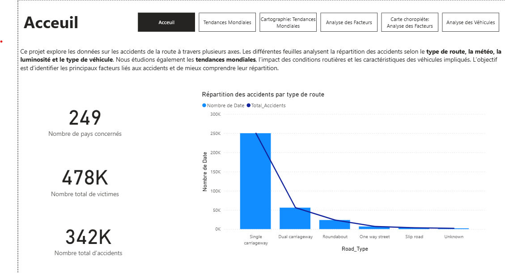
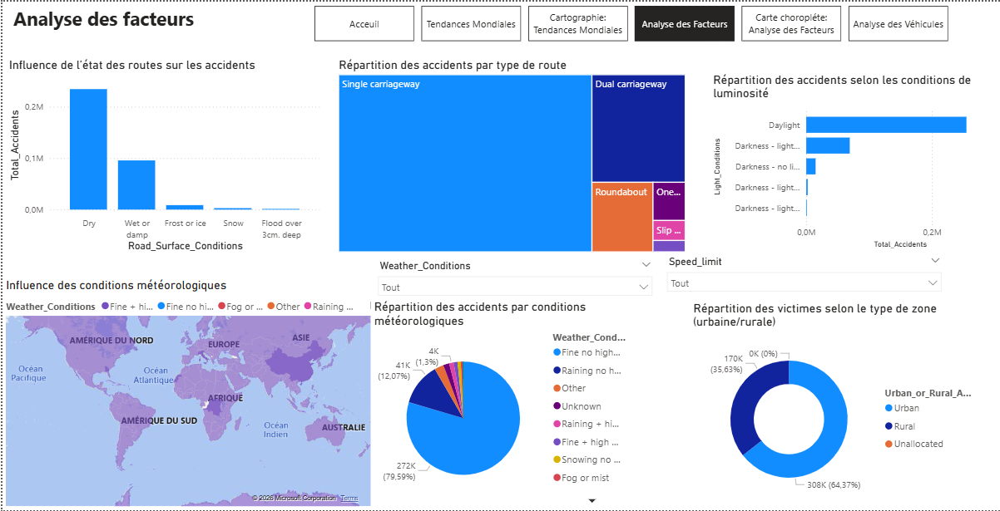
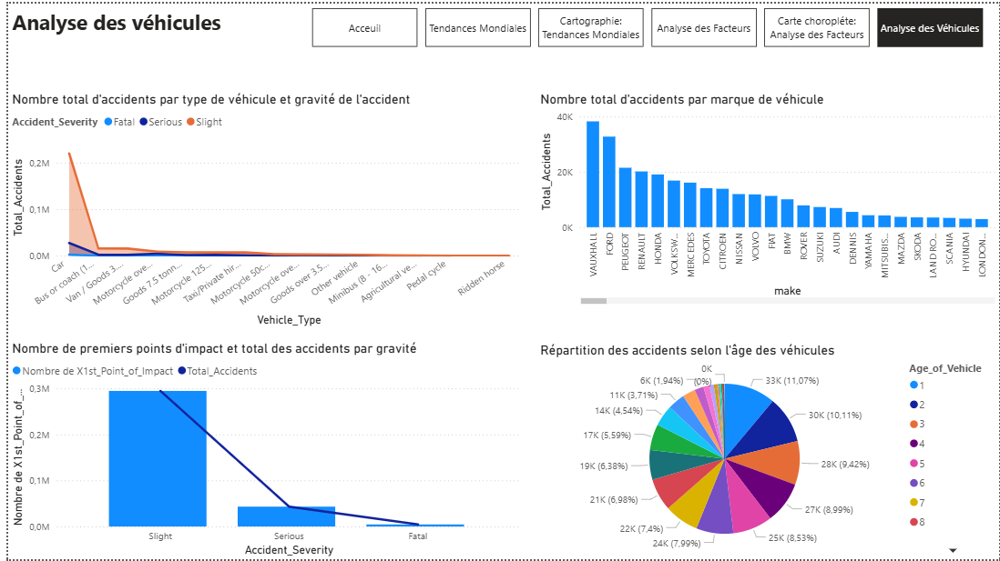
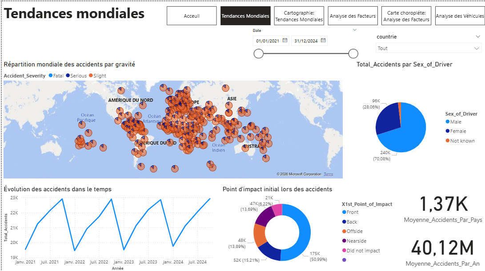

# 🌍 Global Road Traffic Accident Analysis

## 📊 Project Overview
This Power BI project analyzes global road traffic accidents between 2021 and 2024.

The objective is to identify trends, high-risk regions, vehicle-related factors, and environmental influences affecting accident severity.

## 🛠 Tools Used
- Power BI
- DAX
- Snowflake Data Model
- Kaggle Dataset
  
## 📂 Data Source
The dataset used for this dashboard is publicly available on Kaggle:
https://www.kaggle.com/datasets/nextmillionaire/car-accident-dataset-2021-2024

## 📈 Key Insights
- 342K accidents recorded across 249 countries
- Single-lane roads are the most dangerous
- Frontal collisions represent 51% of accidents
- Clear cyclical accident patterns

## 📷 Dashboard Preview

## 📂 Files
 Nada_Belarbi_Power_Bi.pbix
